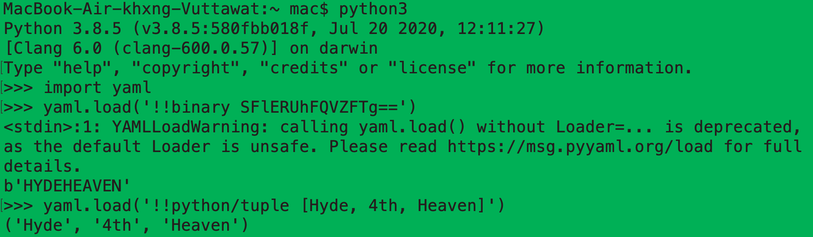

## Welcome to 3rd episode of my series **Code for Security**.  

  
  
  
Today I will dig down to something more advance. I believed you guys must have experience in loading the data from sources. For many types of data that could help your program have great work, yaml.load() is the one of most famous data-loader functions.
  
## yaml.load()
> Basic samples of yaml.load()  

  
 
Default yaml.load() is FullLoader, that's mean its load and do everything the file order the code to do. This is cause vulnerable that let's the untrusted sources input arbitrary Python objects and leads to arbitrary code execution like this:  
> - !!python/object/new:str  
>     args: []  
>     state: !!python/tuple  
>     - "RCE_HERE"  
>     - !!python/object/new:staticmethod  
>       args: [0]  
>       state:  
>         update: !!python/name:exec  
  
## Solution - yaml.safe_load()
While yaml.load() is set its default to FullLoader, **yaml.safe_load()** is set to prevent the code run arbitrary code execution! That's all you need to remember when deciding to use yaml load command.
  
**Another secure function is done!** Secured coding is just a flipped hand when you know the hint!

Let's hunt more vulnerable code to make **Code for Security** next episode. Stay tuned!  
  
**#LoadDataFromUntrustedSources #Code4Sec**  
  
______________________________
<table border="0">
 <tr>
   <td> <h3><i>Although my profile picture is quiet, but the real me can make some noise.</i></h3>
      

      <b> Author: Vuttawat Uyanont </b>   
      <i>Sexiest former engineer & banker who interested in Tech, Sake, and Beer.</i>   
      <b>Studying:</b> Master Computer Science in Cybersecurity Management at Mahanakorn University.    </td>  
   <td></td>  
 </tr>
</table>
  
