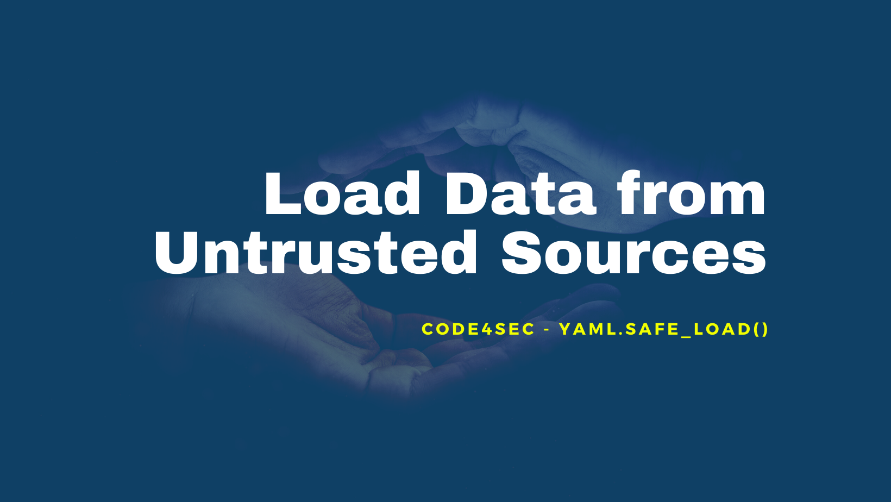

## Welcome to 3rd episode of my series **Code for Security**.  

  
  
  
Today I will dig down to something more advance. I believed you guy must have experience in loading the data from sources. For many types of data that could help your program have a great work, **YAML** is the one of most famous data type. 

## What is YAML?
YAML *(a recursive acronym for "YAML Ain't Markup Language")* is a human-readable data-serialization language. It is commonly used for configuration files and in applications where data is being stored or transmitted. YAML targets many of the same communications applications as Extensible Markup Language but has a minimal syntax which intentionally differs from SGML.  

### Basic samples of YAML  
YAML offers an "in-line" style for denoting associative arrays and lists. Here is a sample of the components. Conventional block format uses a hyphen+space to begin a new item in list.  
> \--- # Character Stats for RPG Game  
> \- Hero: &char001  
>     Name:     HydeHeaven  
>     Level:    99  
>     Attack:   777  
>     Defend:   777  
>     Speed:    777  
  

  
## Solution

  
**Another secure function is done!** Secured coding is just a flipped hand when you know the hint!

Let's hunt more vulnerable code to make **Code for Security** next episode. Stay tuned!  
  
**#LoadDataFromUntrustedSources #Code4Sec**  
  
______________________________
<table border="0">
 <tr>
   <td> <h3><i>Although my profile picture is quiet, but the real me can make some noise.</i></h3>
      

      <b> Author: Vuttawat Uyanont </b>   
      <i>Sexiest former engineer & banker who interested in Tech, Sake, and Beer.</i>   
      <b>Studying:</b> Master Computer Science in Cybersecurity Management at Mahanakorn University.    </td>  
   <td></td>  
 </tr>
</table>
  
